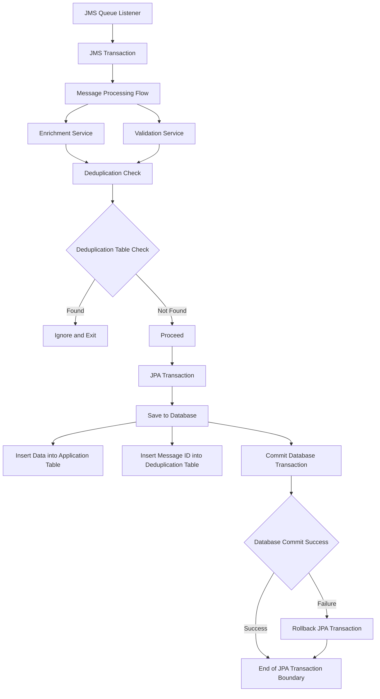

# mq-message-consumer

+-----------------------------------------------+
|                 JMS Queue Listener            |
|-----------------------------------------------|
|  Step 1: Receive Message --> JMS Transaction  |
|  - JMS Transaction Starts                     |
+-----------------------------------------------+
                |
                v
+-----------------------------------------------+
|              Message Processing Flow          |
|-----------------------------------------------|
|  1. Enrichment Service                        |
|  2. Validation Service                        |
+-----------------------------------------------+
                |
                v
+-----------------------------------------------+
|             Deduplication Check               |
|-----------------------------------------------|
|  - Check Message ID in Deduplication Table    |
|  - If Found: Ignore and Exit                  |
|  - If Not Found: Proceed                      |
+-----------------------------------------------+
                |
                v
+-----------------------------------------------+
|                JPA Transaction                |
|-----------------------------------------------|
|  Step 2: Save to Database                     |
|  - Insert Data into Application Table         |
|  - Insert Message ID into Deduplication Table |
|  - Commit Database Transaction                |
|  - If Database Commit Fails: Rollback JPA Tx  |
+-----------------------------------------------+
                |
                v
+-----------------------------------------------+
|       End of JPA Transaction Boundary         |
+-----------------------------------------------+
                |
                v
+-----------------------------------------------+
|             JMS Acknowledgment (Tx)           |
|-----------------------------------------------|
|  Step 3: Acknowledge JMS Message              |
|  - JMS Transaction Commit                     |
|  - If JMS Commit Fails: Message Redelivery    |
+-----------------------------------------------+
